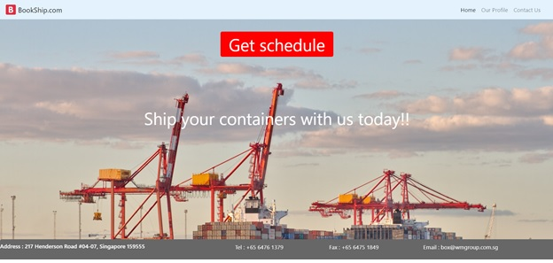
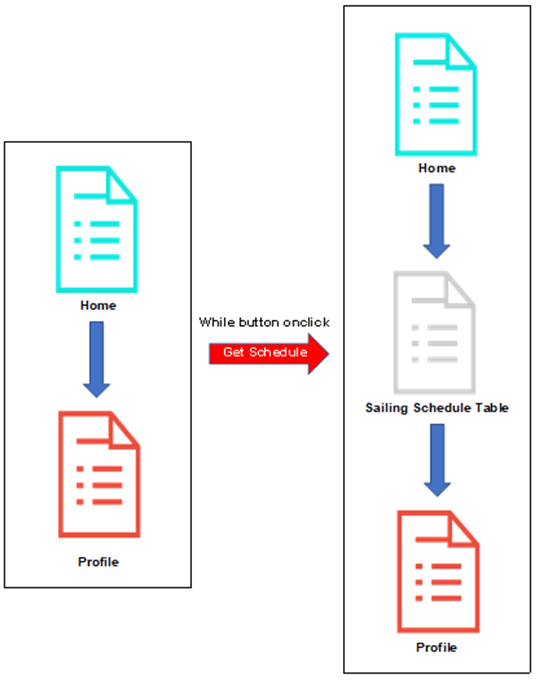
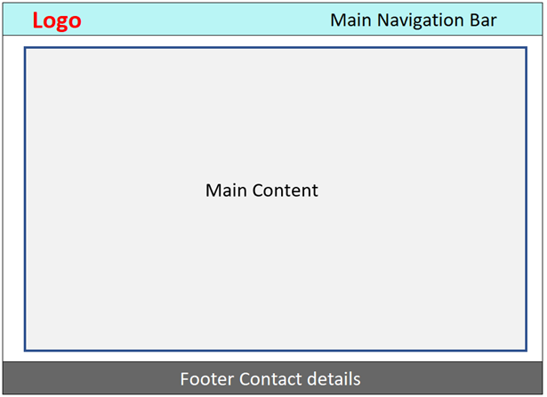
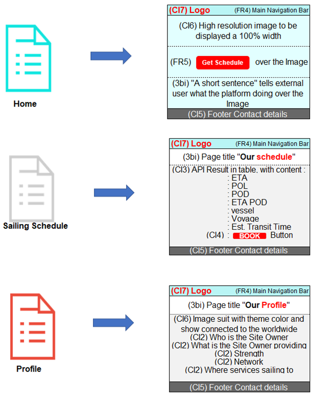
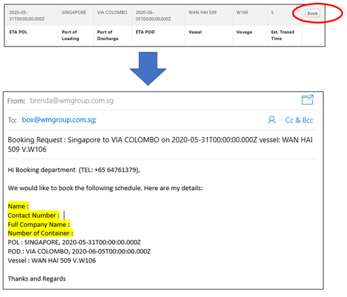
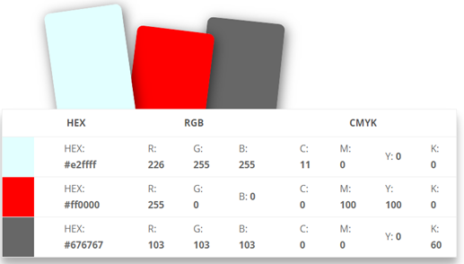

<a href="https://shyan1943.github.io/pro2/"></a>

## Online Shipping Booking Platform

### Interactive Frontend Development Milestone Project 

### Context 
iThis project involves writing custom HTML5, CSS3, API and Javascript/Jquery code to create an online booking platform of at least 3 pages to include:

    * Provide basic company information
    * Provide contact information
    * Customer onclick to find the vessel schedule which fits their supply chain.
    * Customer onclick to book or connect the company 

External user’s goal (The Shipper): The external users are shippers searching for a suitable vessel schedule, which fits their supply chain.

Site owner's goal (The Company): The Site owner's goal is to raise the company revenue and branding by keep up with changing technology trends. 

### Demo

A live website can be found here https://shyan1943.github.io/pro2/

<a href="https://shyan1943.github.io/pro2/"></a>


------

## UX

### 1) STRATERY 
#### 1a) Defining the Project
The purpose of creating this website is to aid Site Owner to reduce their data workload and keep up with changing technology trends to meet their customers’ demands. It will even be better if the External User tumbles upon the website find the suitable vessel schedule and close the deal through the website to achieving both Site Owners' and External Users' business goals. 

#### 1b) Target audience : 

    * Business to business
    * Shipper & Freight Forwarder

#### 1c) Identifying External Users: 
The primary purpose of this platform is to simplify both Site owner and External Users’ daily work process to push the boundaries to connect and booking. Therefore, the website should be interactive to the person who has the authority to making the booking with Site Owner. The person may be the business owners, shipping/logistics/customer service department head or assistant in shipping, freight forwarding, trading industry or manufacturer (hereafter known as "Shippers"). 

#####     Identifying External Users' Objective: 
The shippers’ goal is to deliver the goods as per their clients’ ideal schedule. 
As such, they will have to call their vendors one by one, to look for a suitable sailing schedule and space availability, which may last from hours to days, to be booked. They will only have a short span of time due to the overwhelming thousands of order from time to time. If the schedule is deemed suitable for their clients, they can book the schedule over the platform. 

      EU1. Speed and accuracy
      EU2. Get as much sailing schedule choices as possible 
      EU3. to decide whether the sailing schedule is suitable
      EU4. to understand the Site Owner company profile 
      EU5. to do the booking request straight away
      EU6. to print/download the schedule in soft copy
      EU7. to find out how to contact the Site Owner 


#### 1d) Identifying Site Owners' Objective: 

The Site owner's goal is to raise the company revenue and branding. Therefore, the following objective are set to achieving the goal :

      SO1. To simplify daily data entry and consolidation jobs 
      SO2. Enhance company branding 
      SO3. To simplify External Users’ supply chain 
      SO4. Keep up with changing technology trends 
      SO5. Pushing the boundaries to connect 
      SO6. Stay ahead of the competition 


#### Therefore, the platform should focus on:
      ES1. Upload Excel data (SO1) 
      ES2. Provide Site Owners’ profile to improve the company brand (EU4) (SO2) 
      ES3. Be easily accessible regardless of the device visitor is using (EU1) (SO3)
      ES4. Good Navigation (EU1) (SO3) 
      ES5. Provide an online version of the sailing schedule (EU2) (SO4)  
      ES6. Allow shippers to send booking request straight away (EU5) (SO3) 
      ES7. Allow shippers to contact Site Owner (EU7) (SO5) 
      ES8. Allow shippers to print/download schedule in PDF or Excel template (EU6) (SO3)
      ES9. Allow the shipper to search for the suitable sailing schedule (EU1) (SO6) 


### 2) SCOPE

#### 2a) User stories 
      US1. As a Site Owner, I want to upload my several excel files and it auto return in the sailing schedule platform, so that it can simplify our daily data entry and consolidation jobs. (ES1) 
      US2. As a Site Owner, I want to simplify and assist in shippers’ supply chain, so that we can grow together. (ES3~9) 
      US3. As a shipper, I want to get the sailing schedule information easily within few click, so that I can finish my task as much as possible. (ES4) 
      US4. As a shipper, I want to have more choices on sailing schedule, so that I can get a closest sailing schedule to match my client’s ideal date. (ES5)
      US5. As a shipper, I want to know about the company profile, so that I know Site Owner’s strength area, capabilities & reliable. (ES2) 
      US6. As a shipper, I want to send my booking request straight away through the platform, so that I no need to call anyone to get my booking done. (ES6) 
      US7. As a shipper, I want to print or download the sailing schedule, so that I can plan for my shipment and operation schedule especially bulk orders from client. (ES8) 
      US8. As a shipper, I want to have Site Owner contact details, so that I can get in touch with the them. (ES7) 

#### 2b) Functional Requirement
      FR1. Backend upload Excel sailing schedule, auto convert and store in API (ES1)
      FR2. Site Owner’s company logo & profile (ES2)
      FR3. Responsive design (ES3)
      FR4. Good Navigation that all resources are easy to find, allowing shippers to navigate the layout of the site intuitively. (ES4)
      FR5. Get API Sailing schedule (ES5)
      FR6. Online Booking Request (ES6)
      FR7. Contact methods (ES7)
      FR8. Allow download of sailing schedule (ES8)
      FR9. Searchable sailing schedule (ES9)

#### 2c) Content Requirement
      CR1. Backend Excel sailing schedule data (ES1) 
      CR2. Site Owner’s company profile section (ES2)  
      CR3. Navigation back to home, to get schedule, to profile page and to contact details (ES4) 
      CR4. Sailing schedule section (ES5) 
      CR5. Online Booking Request section (ES6)  
      CR6. Contact section (ES7)
      CR7. Downloadable sailing schedule (ES8) 


### 3) STRUCTURE

#### 3a) Information Architecture
      
##### Content Inventory (CI)
Information required on the website to fulfil the content requirements.

      CI1. Objective (CR2)  
      CI2. company profile (CR2)  
      CI3. Sailing schedule (CR4) 
      CI4. Online Booking Request (CR5)  
      CI5. Contact details (CR6)

##### Image required
      CI6. High resolution photo to be displayed as 100% width image (ES2)
      CI7. Logo (ES2)
      CI8. Profile image (ES2) 

##### Documents
      CI9. Downloadable sailing schedule (CR7)
  
##### Content Structure (CS)
In these modern days, users are constantly bombarded with too much content, people love simplicity. With this, we design it as a "One-page websites" offer a fast and clear reading experience. The contents will be regroup into a sequential structure as below IA Sitemap.



##### Home Page :
```
CI6. It starts with a home page with a 100% width image allow visitor perceive briefly of what is the Site Owner business & understand Site Owner a little better.
CI7. Company Logo display to enhance the company branding 
CI5. Contact details to be fixed at the bottom for the convenience of External User 
CI3. “Get Schedule” Button to generate (CI3) sailing schedule page. 
```
##### Sailing Schedule Page :  
```
CI3. This page return a table, which contents the information External User’ needs. (ETA POL, POL, POD, ETA POD, Vessel, Vovage & transit time). 
      *Definition* 
      ETA = Estimated time of arrival
      POL = Port of Loading 
      POD = Port of Discharge
CI4. A “Book” button to link External User to (CI4) online booking request 
CI9. Downloadable sailing schedule is available in this page as well  
```
##### Profile Page:
```
CI1. This page is to present the Site Owner Objective 
CI2. As well as company profile (e.g. who they are, what services they providing, where is their strength area & etc..) 
CI8. The layout should include a profile image, which is eye catching, suit the theme color and convey the business’ objective 
```


#### 3b) Interaction Design      
##### Learnability
      i.	Different navigation are positions at the familiar location a web surfer, and throughout the website to enhance familiarity and consistency. (FR4)
            a.	Logo that leads back to the home page
            b.	Main navigation fixed at the top 
            c.	Navigation system in the form of site map allowing visitor to view all the sections at a glance
      ii.	Button with hover effect will be used to indicate there's a link to the working project to increase the predictability.
##### Understandability
      i.	Content are group into logical order with short word or phrase title easily understandable 
      ii.	Readability (Flesch Kincaid Reading Ease Test = 78.6, Flesch-Kincaid Grade Level Score = 4)       
##### Operability
      i.	The visitor should be able to easily download the sailing schedule in PDF or excel without encountering any issues. (FR8)
      ii.	Provide a working contact link to allow External User to send an email to Site Owner and response with a positive feedback upon successful submission. (FR7)
      iii.	Allow users to use a text messaging system with web interface familiar to them (FR7)
##### Attractiveness
      i.	Responsive design to take into consideration how it looks when on viewed on a desktop browsers as well as smaller screens like mobile phone. The layout will change to cater for different size of the device. (FR3)
      ii.	Utilization of negative space between different sections and components of the page to increase readability
##### Usability compliance
      i.	Semantic HTML to enhance code readability 
      ii.	Rearrangement of the component 


### 4) SKELETON

#### 4a) Interface design



1. Each page will include three parts - header, main and footer.
2. Header and footer include sections that will be repeated all the pages to improve predictability and consistency.
3. Fixed-top Header will include a logo (CI7) and the main navigation (CR3)
4. Fixed-bottom Footer will include contact details (CI5) and connect the External User with the Site Owner with their preference method (FR7)
5. The main content section will display content related to the page.

##### Sitemap


#### 4b) Navigation design 
If External User get lost, the navigation bar will point them in the right direction. Bootstrap component will be used to make the fixed-top navigation responsive.

##### Logo
Logo on every page, clicking on it will bring the visitor to the Home Page. [Bootstrap Component - Navbar] (FR4) (CI7)

##### Main Navigation
Main Navigation is a fixed position menu at the top of every web page. It designed for External User's convenience from one page to another easily. They are hyperlinked to their respective pages. There is hover function too, so users know its clickable when mouse over. [Bootstrap Component - Navbar] (FR4) 

##### Collapsible Hamburger Mobile Menu
The top navigation will be minimized into a hamburger menu when displayed in mobile screens or other small screens. Clicking on it will display the familiar 3 choices. [Bootstrap Component - Navbar] (FR4) (FR3)

##### Footer Contact Section 
Navigation system is allowing visitor to view all the sections at a glance. By clicking the button “address”, "call us" or "email us", it will direct the user to the call function without typing the phone number, create a new email without typing Site Owner email address and even direct the External User to the correct google map location.

##### Get Schedule button 
When onclick, Axios will get the API data and display it in an organized table. Mean well, hyperlink External User to the sailing schedule table. (FR4), (CI3)  

##### “BOOK” button 
When onclick, it will prompt out a complete “Booking request” email, which External User no need to key in what vessel they are going to booking, recipient as well as Email subject. External User just need to fill up their name, contact details, company name and how many containers you need (highlight in yellow in the image) in the “Booking Request” email will do. 

 

#### 4c) Information Design
##### Corporate Branding
A brand is the set of expectations, memories, stories and relationships that, taken together, account for a consumer's decision to choose one product or service over another. Here are the key design elements we use to create a brand identity that is strong, consistent, and attractive. 

      (3bi) Clear brand purpose and positioning
      (CI6) High resolution photo to be displayed 100% width at the home page, which can build an emotional connection with the External User.
      (CI7) Memorable Logo also created to make an impression.
      (FR4) Good navigation is key to attracting the External User, show them we care about their feeling, even just a single movement on the webpage. We do not want them to get lost. 
      (CI2) A Modern Web Design will tell External User that the company motto “keep moving forward”, “keep improving” : 
            (3a) One-page websites
            (FR3) Responsive design
            (FR5) Get API Sailing schedule (ES5)
            (FR6) Online Booking Request (ES6)
      (5. Surface Color) Attractive color palette 
      (5. Surface Font) Professional typography 


### 5) SURFACE
#### Colour
  
Will choose colors related to logo design as the color palette. This should also be simple, with only 1–3 primary colors. In this website, the corporate logo is sharp red and black font, so I will choose light blue & grey to neutral it. (https://www.sessions.edu/color-calculator/)

#### Fonts
Font-Family “Sans serif” are chosen as the most famous fonts are recognizable even when taken out of context. A single primary typeface to lead the brand identity design, and it also work well with the logo and color palette. And giving the image of being modern, approachable, and clean. 
CSS rules to specify families (font-family: 'Open Sans', sans-serif; )
Body Regular 400 (https://fonts.googleapis.com/css2?family=Open+Sans&display=swap")
Logo Semi-bold 600 (https://fonts.googleapis.com/css2?family=Open+Sans:wght@400;600&display=swap")

#### Images
Full-width cover “containers port” image selected aims to build an emotional connection with External User, tell them what this platform is doing, related to which industry as well as Illustrations strengthen the branding.


------

## Features

##### Responsiveness
      Feature 1. Allow the External User to view the platform with all devices, like desktop, laptop, tablets and smart mobile phones. It can be view in both portrait and landscape orientation as well by implement the responsive design. (US3) (FR3) 
      
##### Ease of navigation
      Feature 2. Allow the External User to view all the sections at a glance and from one page to another easily by having the fixed-up position & hover effect navigation system (FR4)
      Feature 3. Allow the External User to get the sailing schedule straightaway, by having “Get Schedule” button at the Center of the home page and hyperlink it to “Our schedule” page directly. (US3) (FR5) 

##### Consistency and predictability
      Feature 4. Allow the External User to stay clear and easy find the same components position at the same place regardless of which page they are at by having the header, footer and theme stay consistent throughout the site. 

##### Contact Section
      Feature 5. Allow the External User to get in touch with Site Owner at the most efficiency way, by having fixed-bottom bar at every page (US8) (ES7)
      Feature 6. Allow the External User to get in touch with Site Owner at their preference method, by having the hyperlink at the address, contact and email to their preference method. (SO3)

##### Profile Page 
      Feature 7. Allow the External User to know about the Site Owner’s strength area, capabilities & reliable, by having a good write-up (US5) (ES2) 

##### Schedule Page 
      Feature 8. Allow the External Users to simplify theirs’ supply chain, by having the online sailing schedule. (US2) (ES3~9) 
      Feature 9. Allow the External User to get the sailing schedule information easily just one click, by having the “Get Schedule” Hyperlink button at the center of the Home page. (US3) (ES4) 
      Feature 10. Allow the External User to print or download the sailing schedule in excel or pdf format, by having the downloadable function. (US7) (ES8) 

##### Booking Request 
      Feature 11. Allow the External User to select the specific sailing schedule straightaway through the platform, by having the “BOOK” buttons on each line of the sailing schedule. (US6) 
      Feature 12. Allow the External User to send booking request straightaway through the platform with typing as less as possible, by hyperlinking the “BOOK” button to the Online Booking Request template (US6) (ES6) (FR6) 

##### Backend restdb.io 
      Feature 13. Allow the Site Owner to simplify their daily data entry and consolidation jobs, by having them to upload several excel files on restdb.io and it auto-organize & return in the sailing schedule platform. (US1) (ES1) 

#### Features Left to Implement
      Feature 15. Allow the Site Owner to simplify their daily data entry and consolidation jobs, by implement the upload excel files method on same website instead of backend restdb.io  


------
## Technologies Used 
1) <a href="https://fonts.google.com">Google Font</a> to making the web more beautiful, fast, and open through great typography 
2) <a href="https://www.sessions.edu/color-calculator/">Sessions College color calculator</a> to find the perfect color scheme 
3) <a href="https://unsplash.com">Unsplash</a> to get an high resolution image
4) <a href="https://www.w3schools.com/html/html_intro.asp">HTM5</a> to structure the webpages
5) <a href="https://www.w3schools.com/css/css_intro.asp">CSS3</a> to style HTML contents
7) <a href="https://getbootstrap.com/docs/4.0/components/navbar/">Bootstrap 4 Navbar</a> for the main navigation
8) <a href="https://getbootstrap.com/docs/4.0/components/jumbotron/">Bootstrap 4 Jumbotron</a> to displaying the fixed-bottom contact section.
9) <a href="https://bootstrap-table.com/docs/getting-started/introduction/">bootstrap-Table</a> for An extended table to the integration with some of the most widely used CSS frameworks. 
10) <a href="https://github.com/">Github</a> for Versioning Control System and GitHub for repositories.
11) <a href="https://code.visualstudio.com">Visual Studio Code</a> for code editor redefined and optimized for building and debugging modern web ) 
12) <a href="https://restdb.io">Restdb.io</a> for uploading csv data, it model the information and store it online database backend automatically. 
13) <a href="https://jquery.com/">JQuery</a> to simplify DOM manipulation.
14) <a href="https://cdnjs.com/libraries/axios">Axios</a> for JavaScript which can be used in your front-end application and in your API/Json backend
15) <a href="https://github.com/Code-Institute-Solutions/readme-template/blob/master/README.md">Code Institute Readme.md template</a> for Readme file report guideline 
16) <a href="http://validator.w3.org/">W3 Markup Validation Service</a> for validating markup,
17) <a href="https://validator.w3.org/checklink">W3C Link Checker</a> for checking links
18) <a href="https://www.10bestdesign.com/dirtymarkup/">Dirty Markup</a> for cleaning up HTML and CSS Codes
19) <a href="https://worditout.com/word-cloud/create">Word It Out</a> for creating word cloud
20) <a href="https://responsivedesignchecker.com/">Responsive Web Design Checker</a> for checking how it looks like on other devices

      

